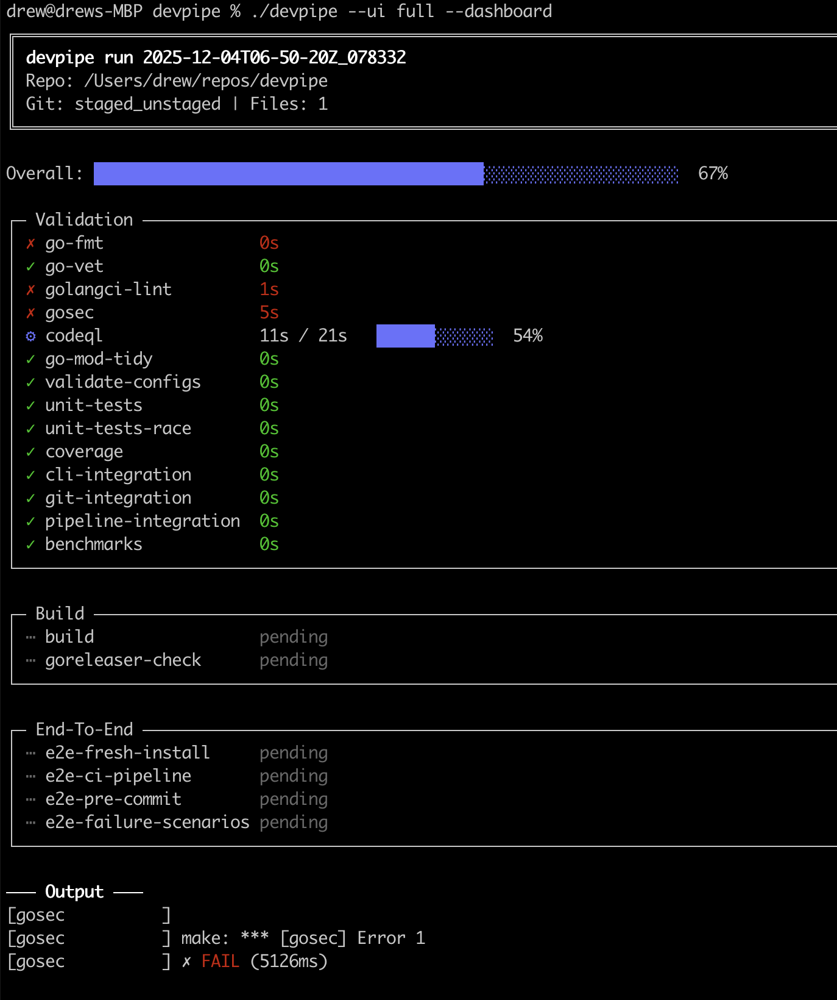
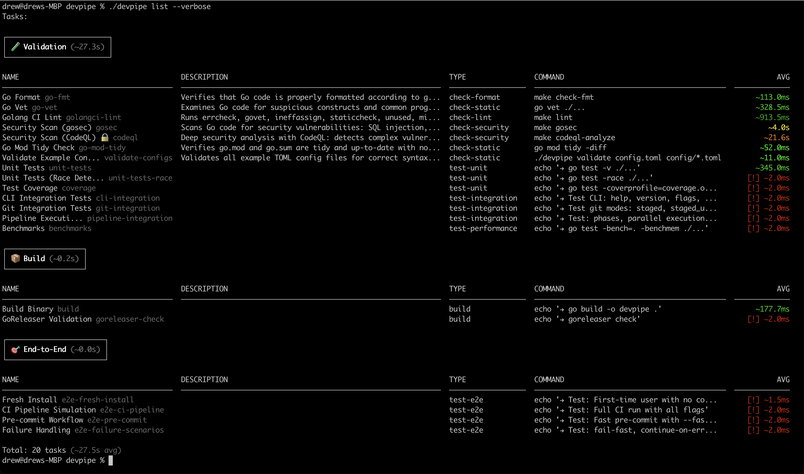
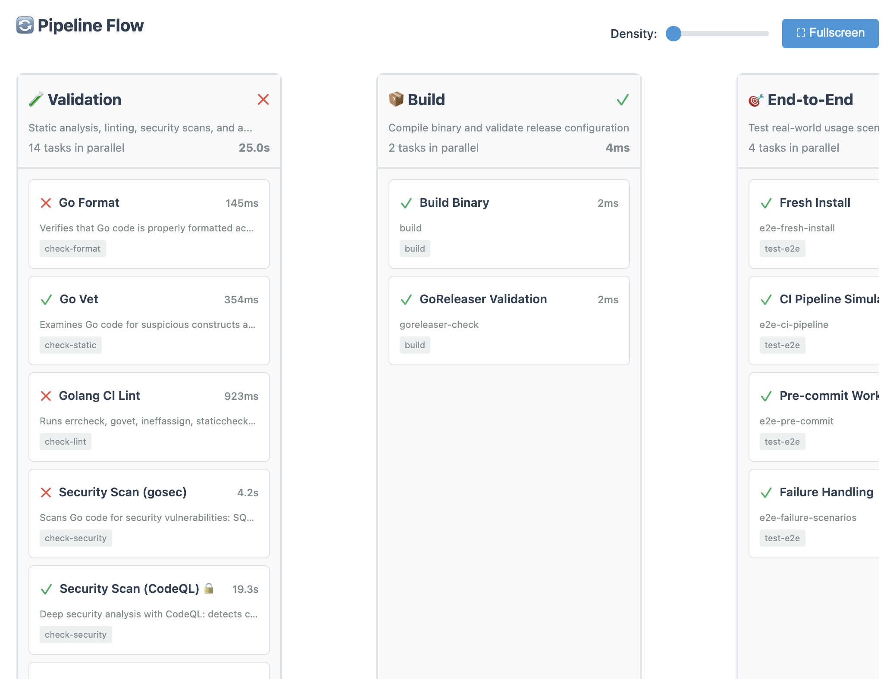
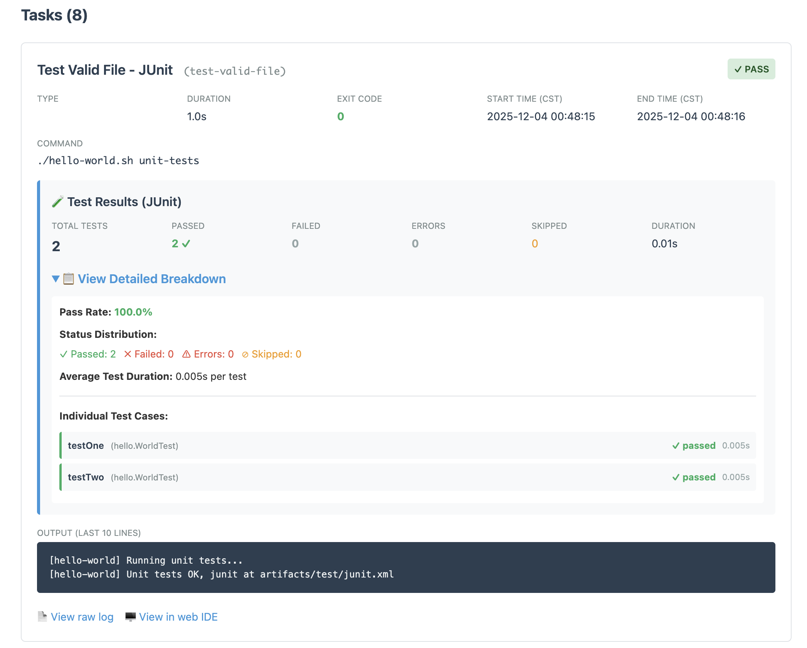
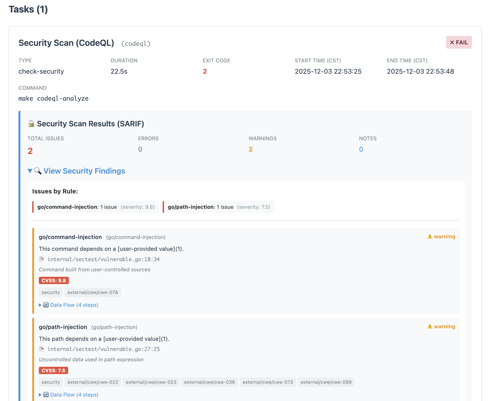
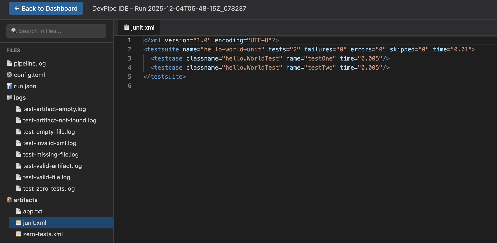

# Features

## Core Features

- 🚀 **Single binary** - Golang - no dependencies, just download and run
- 🎨 **Beautiful UI** - Animated progress in the terminal, colored output, grouping
- ⚙️ **Phase-based execution** - Run tasks in sequence or **parallel**  🏎️💨⚡🚀
- 📝 **TOML configuration** - Simple, readable config files
- 🔧 **Auto-fix** - Support for automatically fixing formatting, linting, and other fixable issues
- 🔀 **Git integration** - Run checks on staged, unstaged, or ref-based changes
- 📊 **Metrics & Dashboard** - JUnit/SARIF/artifact parsing, HTML reports with security findings
- 🎯 **Flexible** - Run all, skip some, or target specific tasks

## Screenshots

### Dashboard View

Live progress dashboard with animated task execution. Shows all tasks grouped by phase with real-time status updates, timing information, and parallel execution visualization.

**Command:** `devpipe --ui full --dashboard`

### Terminal Output

Standard terminal output showing task execution with colored status indicators, timing information, and clear success/failure states. Perfect for CI/CD environments or when you prefer simpler output.

**Command:** `devpipe`

### Task List View

Overview of all configured tasks showing their type, command, and average execution time. Useful for understanding your pipeline structure at a glance.

**Command:** `devpipe --ui full`

### Pipeline Flow Visualization

Visual representation of how tasks are organized into phases and which tasks run in parallel vs. sequentially. Helps you understand and optimize your pipeline execution strategy.

### Test Results & Metrics

Parsed JUnit/SARIF/artifact results displayed in an easy-to-read format. Shows test failures, coverage metrics, and other quality indicators directly in the terminal.

**Features:**
- JUnit XML parsing for test results (shown in image below)
- SARIF parsing for security findings
- Artifact tracking for build outputs

### Security Findings

Security scan results with detailed vulnerability information, severity levels, and remediation guidance. Integrates with tools like gosec, CodeQL, and other SARIF-compatible scanners.

**Supported formats:**
- SARIF (Static Analysis Results Interchange Format)
- Custom security scanner outputs

### IDE Integration

HTML IDE that opens in your browser for detailed analysis of pipeline logs. Includes search, syntax highlighting, and file viewer.

